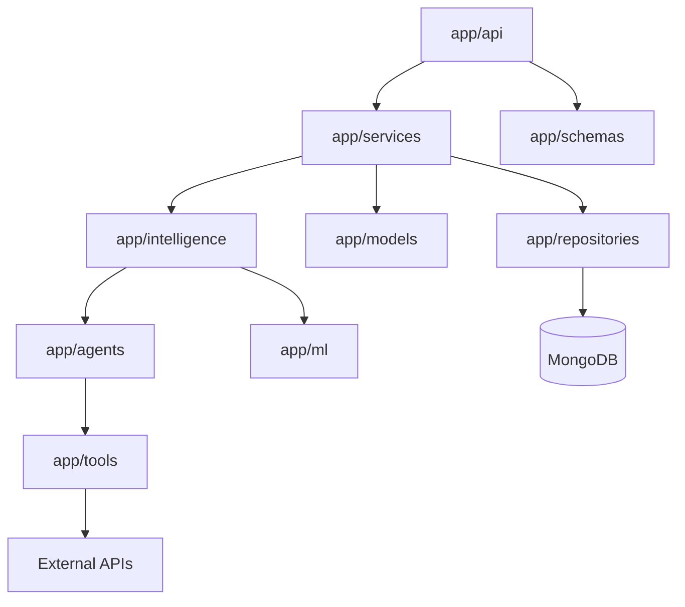
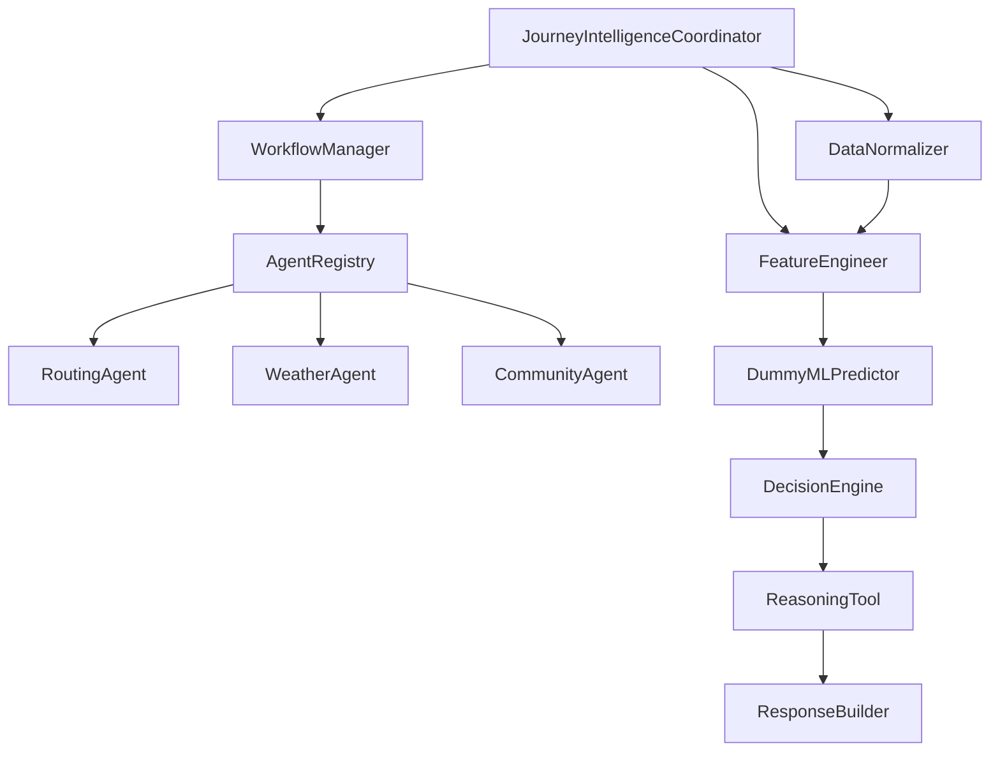
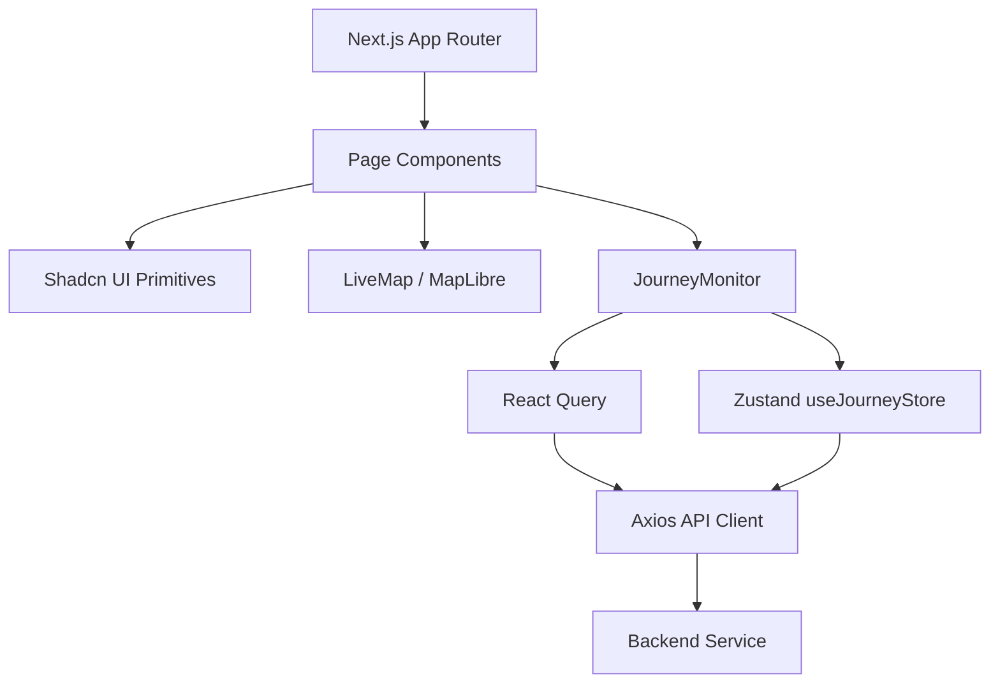

# SafeShe Dependency Graphs

This document visualizes the structural and execution dependencies between various modules in the SafeShe architecture.

## 1. Top-Level Module Dependency Graph

This graph illustrates how the high-level directories and packages depend on each other within the backend.

## 2. Intelligence Pipeline Dependency Graph

The Agentic AI architecture utilizes a strict, directed acyclic execution flow managed by the `JourneyIntelligenceCoordinator`.

## 3. Frontend Architecture Dependency Graph

How UI components map to the underlying state and API client.

## Circular Dependencies
*Based on the architecture review, there are currently **no known circular dependencies**.*
The backend adheres strictly to layered architecture protocols (Routers -> Services -> Intelligence -> Agents -> Providers). To enforce this, the `JourneyIntelligenceCoordinator` interacts with the Agent layer downwards, and Responses are mapped back up via Pydantic builders, ensuring the Intelligence layer never imports the API Routers or external Server contexts.
