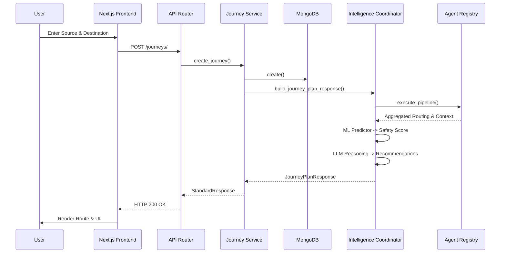

# SafeShe Data Flow

This document details the step-by-step execution flows across the SafeShe architecture for major product features.

## 1. Journey Planning Flow

When a user intends to navigate from Point A to Point B, the system executes a complex orchestration pipeline that queries multiple external providers before returning the optimal route.

### Sequence
1. **User**: Inputs Source and Destination in the Frontend (`LiveMap`).
2. **Frontend**: Sends `POST /api/v1/journeys/` with `JourneyCreate` payload.
3. **API Router**: Validates request parameters and injects user token.
4. **Backend**: `JourneyService` persists a `PLANNED` state representation into MongoDB.
5. **Service**: `JourneyService` calls `JourneyIntelligenceCoordinator.build_journey_plan_response()`.
6. **AI Orchestrator**: The Coordinator begins the Agentic Workflow.
    - Asks `RoutingAgent` to fetch GeoJSON from Mapbox/OSRM.
    - Asks `WeatherAgent` to fetch environmental context.
    - Asks `CommunityAgent` to check bounding box for nearby reports in the DB.
7. **ML Pipeline**: 
    - `DataNormalizer` flattens the aggregated data.
    - `FeatureEngineer` extracts numerical risk factors.
    - `DummyMLPredictor` returns a `safety_score`.
8. **LLM Engine**: `ReasoningTool` evaluates the decision array and generates human-readable AI recommendations.
9. **Response Builder**: Data is structured into a `StandardResponse[JourneyPlanResponse]`.
10. **Frontend**: Receives the response, updates `useJourneyStore`, and renders the geometry on `LiveMap`.

### Mermaid Diagram

---

## 2. Live Tracking & AI Telemetry Flow

During an active trip, SafeShe continuously monitors the user's location and evaluates ambient risk.

### Sequence
1. **User**: Begins moving. Device GPS triggers coordinate updates.
2. **Frontend**: `LiveMonitorService` repeatedly polls `GET /api/v1/journeys/{id}/monitor`.
3. **Backend**: `JourneyService` intercepts the request.
4. **Service**: Re-queries the `JourneyIntelligenceCoordinator`.
5. **AI Orchestrator**: Re-runs a lightweight subset of the Agentic Workflow to detect realtime deviations, weather shifts, or new community alerts.
6. **Response**: Realtime adjustments (e.g., "Rerouting suggested: accident reported ahead") are returned.
7. **Frontend**: `JourneyMonitor` component updates the UI with the fresh Safety Score and Alerts.

*(Note: WebSockets via `/api/v1/ws/journey` are also implemented for true push-based streaming, replacing the polling fallback where supported).*

---

## 3. Emergency SOS Flow

If the user triggers the physical or digital SOS button.

### Sequence
1. **User**: Triggers SOS.
2. **Frontend**: Opens a high-priority WebSocket connection to `/api/v1/ws/emergency/`.
3. **Backend API**: The `emergency_ws.py` router accepts the connection.
4. **Backend Service**: Upgrades the Journey state in MongoDB to `SOS`.
5. **Emergency Agent**: Immediately triggers external webhooks (e.g., Twilio API for SMS to Emergency Contacts).
6. **Frontend**: Streams ambient audio/video telemetry payloads over the active socket to be logged by the backend.
