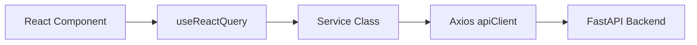

# SafeShe API Usage & Contracts

This document explains how the frontend integrates with the backend API layer.

## Architecture

The frontend follows a strict separation of concerns for API interaction:
1. **Axios Client (`api/client.ts`)**: Defines global HTTP rules, interceptors, and JWT token injection.
2. **Service Classes (`api/services/*.ts`)**: Wraps `apiClient` calls into strongly typed async functions returning Promises.
3. **React Query Hooks (`hooks/use*.ts`)**: Wraps the Service classes in `react-query` to provide caching, loading states, error handling, and auto-polling (where applicable) directly to React components.

## Global Interceptors

`apiClient` automatically attaches the `safeshe-auth-storage` JWT token from `localStorage` into the `Authorization: Bearer <token>` header of every outgoing request. 

If no token is found, it injects a fallback header `x-user-id: 123456789012345678901234` strictly for backward compatibility with Phase 1 development routes.

## Available Services

| Service | Endpoints | Purpose |
|---------|-----------|---------|
| `authService` | `POST /api/v1/auth/login`, `/api/v1/auth/register` | Authentication and JWT retrieval. |
| `assistantService` | `POST /api/v1/assistant/chat` | Conversational AI messaging. |
| `dashboardService` | `GET /api/v1/dashboard/metrics` | Fetches historical analytics for the `/home` page. |
| `emergencyService` | `POST /api/v1/emergency/sos`, `/cancel` | Triggers high-priority SOS alerts. |
| `liveMonitorService` | `GET /api/v1/live/{id}` | Telemetry polling (used by `useLiveMonitor`). |
| `journeyService` | `POST /api/v1/journeys/` | Generates safe routes via AI. |
| `communityService` | `GET /api/v1/community/`, `POST /api/v1/community/` | Reads/writes crowd-sourced anomaly reports. |
| `profileService` | `GET /api/v1/profile/` | Reads user data. |
| `settingsService` | `GET /api/v1/settings/` | Reads app config. |

## WebSockets

For real-time streaming, the application bypasses `axios` and opens a raw JavaScript `WebSocket`. 

This is actively implemented in `journeyService.connectToJourneyWebSocket`, which connects to `ws://localhost:8000/api/v1/ws/journey/{journeyId}` to receive instant `AgentAlert` push notifications while a journey is active.
