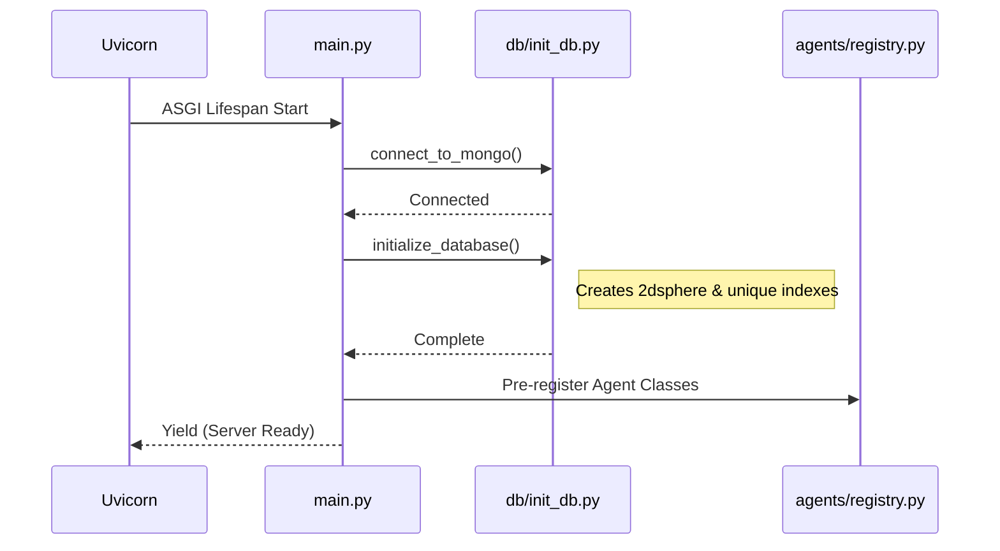
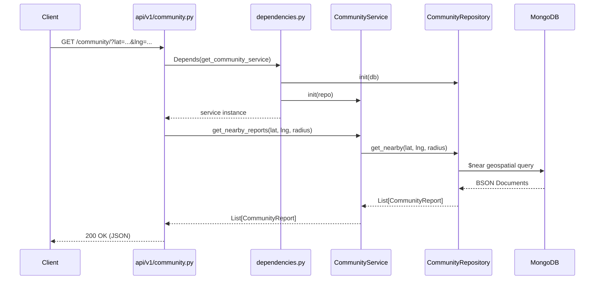
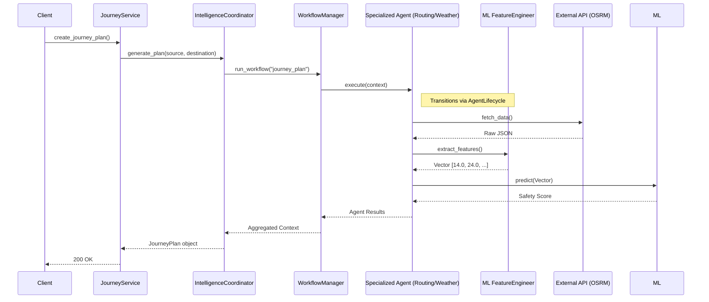
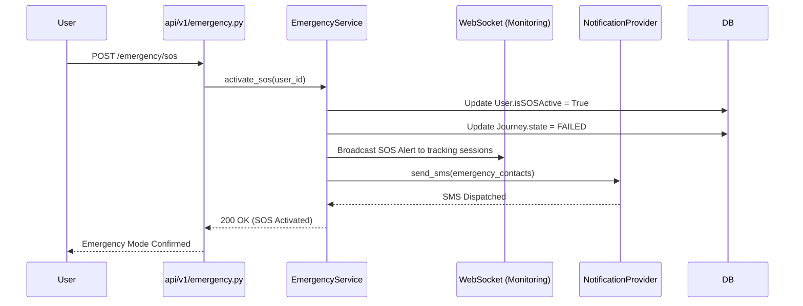

# SafeShe Backend Execution Flow

This document outlines the sequential execution flows for core system operations using Mermaid sequence diagrams.

## 1. Application Startup Flow

## 2. Standard Request Flow (e.g., Fetch Community Reports)

## 3. Agentic Journey Planning Flow

## 4. Emergency / SOS Flow

