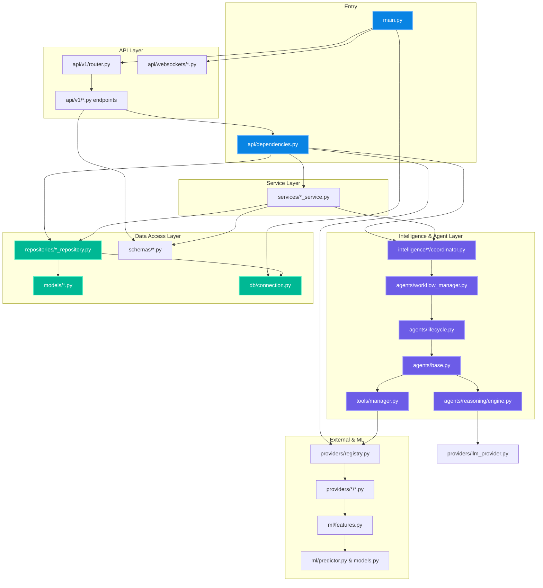

# SafeShe Backend Import Graph

This document visualizes the complete dependency injection and import architecture of the backend, from the entry point down to the statistical ML models and external providers.

