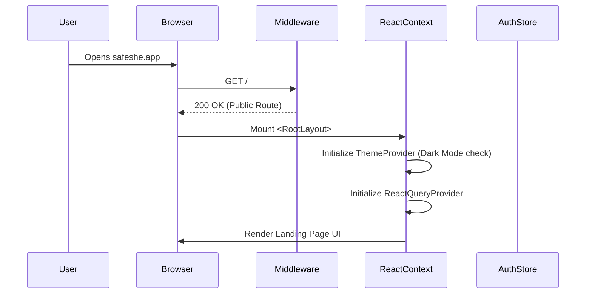
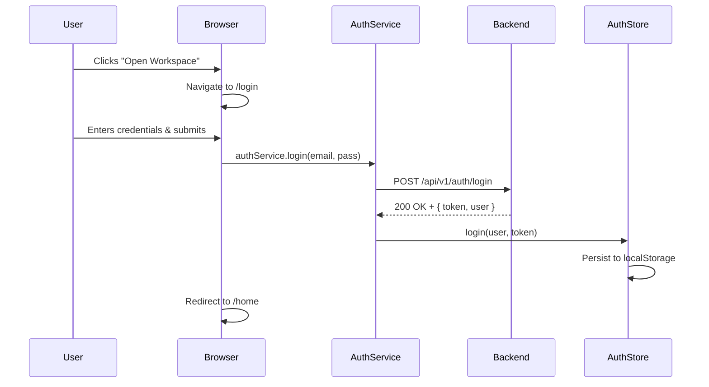
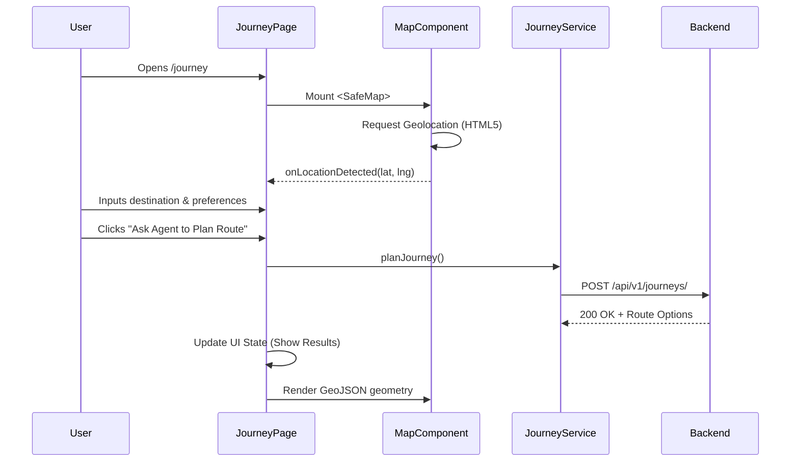
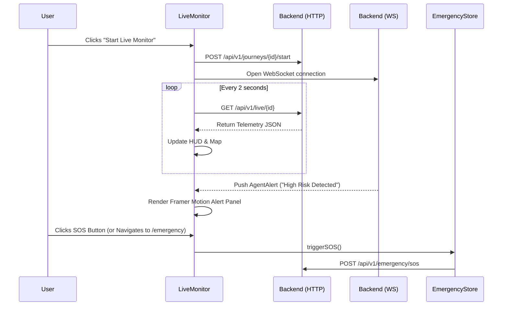

# SafeShe Frontend Execution Flow

This document outlines the sequential execution flow of the application lifecycle from a user's perspective.

## 1. Application Initialization Flow

## 2. Authentication Flow

## 3. Core Journey Planner Flow

## 4. Live Telemetry & SOS Flow

