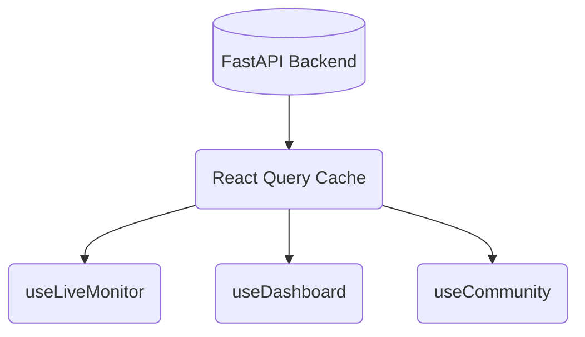

# SafeShe Global State Flow

This document explains how state is managed and persisted across the React frontend.

## State Strategy

SafeShe splits state management into three distinct paradigms depending on the data's lifecycle and persistence requirements.

### 1. Global Client State (Zustand)
Used for data that originates in the client, rarely changes, and needs to persist across hard browser reloads or route changes.

- **`authStore.ts`**: Holds the `user` object and `accessToken`. Uses Zustand's `persist` middleware to automatically serialize/deserialize from the browser's `localStorage` under the key `safeshe-auth-storage`.
- **`emergencyStore.ts`**: Holds a boolean `isSOSActive`. Allows the SOS state to remain active if the user navigates away from the `/emergency` page back to the Dashboard.

### 2. Global Server State (React Query)
Used for any data that originates from the backend. 
Instead of dispatching Redux actions or manually setting `useState`, the application relies entirely on `@tanstack/react-query`.

- Caches responses automatically.
- Provides `isLoading` and `error` states out of the box.
- Handles polling (e.g., `useLiveMonitor` polls every 2 seconds).

### 3. Local Ephemeral State (React `useState`)
Used for strictly presentational or highly-local interactive states that do not need to survive unmounting.

**Examples:**
- `activeTransport` ("walking", "driving") inside `journey/page.tsx`.
- Modal open/close flags (e.g., `selectedRouteDetail`).
- Input string values before form submission.
